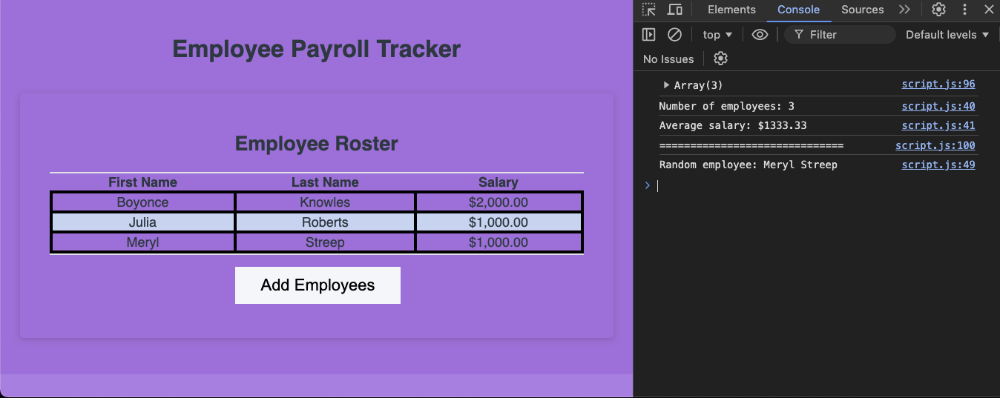

# Payroll-Tracker

## Description
The Employee Payroll Tracker is a web application that allows users to input employee information, including first name, last name, and salary. After inputting multiple employees, the data is displayed in a table sorted alphabetically by last name. The application also calculates and displays the average salary and selects a random employee to display in the console.

## Features
- Add multiple employees with their first name, last name, and salary.
- Salary input defaults to $0 if the user enters an invalid value.
- Employees can be added until the user chooses to stop.
- Displays all employee data in a table on the web page, sorted alphabetically by last name.
- Shows the average salary and the number of employees in the console.
- Randomly selects and displays an employee in the console.

### Usage
1. Click the **Add Employees** button to begin adding employees.
2. You will be prompted to enter the employee's first name, last name, and salary.
3. After entering the employee's information, you can choose to add another employee or stop.
4. Once you stop adding employees, the employee data will be displayed in a table.
5. The average salary and a random employee will be logged to the console.

## Mock-Up

The following image shows the web application's appearance and functionality:
![Shows employee information displayed plus a random employee selected and displayed in the console of an employee payroll tracker.]

## Deployed site:
  https://andreacannon.github.io/Payroll-Tracker/

